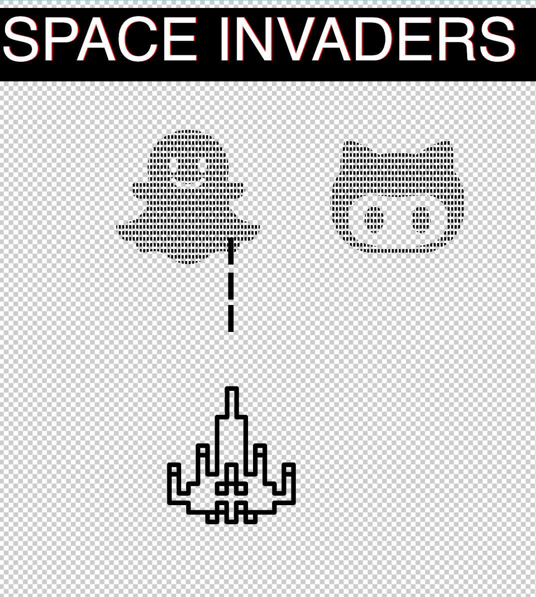

<p align="center"></a></p>


<h1 align="center">Dokumentation Tara Monheim</h1>

## Details

Technisches Grundlagenprojekt bei Martin Schneider.

**Erstes Projekt**: Verständnis und glitchen eines SVG Files.  
 
**Zweites Projekt**: Verbinden des Phillip Hue mit dem Rasperry Pi  
sowie Steuerung der Helligkeit und Farbe.  
Mitglied der "Lampen" Gruppe. (zu finden im iot-share/ wiki: https://iot-share/wiki/Phillips_Hue)

##### Projektübersicht  

* [svgglitch](#svgglitch)  

## svgglitch

Bei meinem SVG Glitch Projekt habe ich verschiedene Versionen von SVG Files erstellt, bei denen ich mein Verständnis für dieses File Format erweitert habe. Mit der Extension auf VS Code: [XML Tools](https://marketplace.visualstudio.com/items?itemName=DotJoshJohnson.xml) habe ich diese mit einer Art Beautify Filter überarbeitet. Ein sehr hilfreiches Tool um das Svg übersichtlicher zu machen.    
Die Icons habe ich von der Open Source [ionicons](https://ionicons.com/) Website.

Das Spaceship: Icons erstellt von <a href="https://www.flaticon.com/de/autoren/smashicons" title="Smashicons">Smashicons</a> from <a href="https://www.flaticon.com/de/" title="Flaticon"> www.flaticon.com</a>  
Die Filter zur Animation der Schrift: [Codepen](https://codepen.io/DirkWeber/pen/ArFvk)  
Die Formen: [W3schools](https://www.w3schools.com/)

>Erster Schritt: geglitchter Text durch Filter 

1. Zunächst wird die Viewbox definiert. Eine Zeichenfläche von beliebiger Größe, aber mit einem bestimmten Seitenverhältnis.  Innerhalb des umfassenden Elements wird die Grafik dann mit einer bestimmten Größe angezeigt.
Der Viewport der SVG-Grafik wird durch das viewBox-Attribut sowie width- und height-Attribute im svg-Tag angegeben.

2. In dem  ```<defs>``` Tag wird die Schrift definiert, sowie Farbe der einzelnen Zustände.  
3. Mit dem ```<filter>``` Tag wird der Filter definiert und ihm wird eine id zugewiesen, auf dem dann am Ende zugegriffen wird. 
4. Mit dem ```<animate>```Tag werden diese einzelnen Zustände animiert. Mit Attributen wie <kbd>indefinite</kbd>, werden die Zustände in einem Loop wiederholt.


<svg version="1.1" id="Ebene_1" xmlns="http://www.w3.org/2000/svg" xmlns:xlink="http://www.w3.org/1999/xlink" width="600px" height="100px" viewBox="0 -123 1500 500">
    <defs>
        <filter id="filter">
            <feFlood flood-color="black" result="blue"/>
            <feFlood flood-color="red" result="flood1"/>
            <feFlood flood-color="limegreen" result="flood2"/>
            <feOffset in="SourceGraphic" dx="3" dy="0" result="off1a"/>
            <feOffset in="SourceGraphic" dx="2" dy="0" result="off1b"/>
            <feOffset in="SourceGraphic" dx="-3" dy="0" result="off2a"/>
            <feOffset in="SourceGraphic" dx="-2" dy="0" result="off2b"/>
            <feComposite in="flood1" in2="off1a" operator="in" result="comp1"/>
            <feComposite in="flood2" in2="off2a" operator="in" result="comp2"/>
            <feMerge x="0" width="100%" result="merge1">
                <feMergeNode in="black"/>
                <feMergeNode in="comp1"/>
                <feMergeNode in="off1b"/>
                <animate attributeName="y" id="y" dur="4s" values="104px; 104px; 30px; 105px; 30px; 2px; 2px; 50px; 40px; 105px; 105px; 20px; 6ßpx; 40px; 104px; 40px; 70px; 10px; 30px; 104px; 102px" keyTimes="0; 0.362; 0.368; 0.421; 0.440; 0.477; 0.518; 0.564; 0.593; 0.613; 0.644; 0.693; 0.721; 0.736; 0.772; 0.818; 0.844; 0.894; 0.925; 0.939; 1" repeatCount="indefinite"/>
                <animate attributeName="height" id="h" dur="4s" values="10px; 0px; 10px; 30px; 50px; 0px; 10px; 0px; 0px; 0px; 10px; 50px; 40px; 0px; 0px; 0px; 40px; 30px; 10px; 0px; 50px" keyTimes="0; 0.362; 0.368; 0.421; 0.440; 0.477; 0.518; 0.564; 0.593; 0.613; 0.644; 0.693; 0.721; 0.736; 0.772; 0.818; 0.844; 0.894; 0.925; 0.939; 1" repeatCount="indefinite"/>
            </feMerge>
            <feMerge x="0" width="100%" y="60px" height="65px" result="merge2">
                <feMergeNode in="black"/>
                <feMergeNode in="comp2"/>
                <feMergeNode in="off2b"/>
                <animate attributeName="y" id="y" dur="4s" values="103px; 104px; 69px; 53px; 42px; 104px; 78px; 89px; 96px; 100px; 67px; 50px; 96px; 66px; 88px; 42px; 13px; 100px; 100px; 104px;" keyTimes="0; 0.055; 0.100; 0.125; 0.159; 0.182; 0.202; 0.236; 0.268; 0.326; 0.357; 0.400; 0.408; 0.461; 0.493; 0.513; 0.548; 0.577; 0.613; 1" repeatCount="indefinite"/>
                <animate attributeName="height" id="h" dur="4s" values="0px; 0px; 0px; 16px; 16px; 12px; 12px; 0px; 0px; 5px; 10px; 22px; 33px; 11px; 0px; 0px; 10px" keyTimes="0; 0.055; 0.100; 0.125; 0.159; 0.182; 0.202; 0.236; 0.268; 0.326; 0.357; 0.400; 0.408; 0.461; 0.493; 0.513;  1" repeatCount="indefinite"/>
            </feMerge>
            <feMerge>
                <feMergeNode in="SourceGraphic"/>
                <feMergeNode in="merge1"/>
                <feMergeNode in="merge2"/>
            </feMerge>
        </filter>
    </defs>
    <g>
        <text x="0" y="100" style="filter:url(#filter);fill:#000;font-family:'source code',sans-serif;font-size:200px;-webkit-font-smoothing:antialiased;-moz-osx-font-smoothing:grayscale">
            SPACE INVADERS
        </text>
    </g>
</svg>

Hier habe ich einen Filter von [Codepen](https://codepen.io/DirkWeber/pen/ArFvk) angewendet.


>Zweiter Schritt: Formen und Farben im SVG File einfügen und verändern 

1. Nachdem die Viewbox definiert wurde kann man nun mit den ```<path>```Tags die Ids der einzelnen SVG´s einsetzten.
2. Durch das Attribute **stroke width** wird die Strichstärke der Umrandung geändert. **Fill** ordnet dem Svg eine Farbe zu.
3. Das Element circle (Kreis) gehört zu den Grundformen in SVG. Kreise werden durch Angabe eines Mittelpunkts und eines Radius erzeugt.
``` 
<svg viewBox="0 0 100 100" fill= "red" stroke= "black">
  <circle cx="30" cy="30" r="30"/> 
  ```
4. <kbd>d</kbd> = Dieses Attribut definiert die Form des Pfades.
5. <kbd>path</kbd> SVG Element ist das allgemeine Element zum definieren einer Form. Alle Grundformen können mit einem path-Element erzeugt werden.
6. <kbd>Linienbefehle:</kbd> 

Jeder dieser Befehle wird instanziert (z.B. das Erstellen einer Klasse, deren Benennung oder deren Lokalisierung) mit einem bestimmten Buchstaben. Beispielsweise: Verschiebe zur x- und y-Koordinate (10, 10). Der "Move to" Befehl wird mit dem Buchstaben <kbd>M</kbd> aufgerufen. Wenn der Parser zu diesem Buchstaben kommt, weiss er, dass eine Verschiebung zu einem Punkt erwünscht ist. Um nun also eine Verschiebung zu (10, 10) vorzunehmen, würde man den Befehl "M 10 10" benutzen. Danach liest der Parser der nächsten Befehl aus.  

Alle dieser Befehle gibt es in zwei Varianten. Ein Grossbuchstabe gibt absolute Koordinaten auf der Seite an und ein Kleinbuchstabe gibt relative Koordinaten (z.B. verschiebe vom vorherigen Punkt 10px nach oben und 7px nach links).

Koordinaten im "d" Attribute sind immer einheitslos und somit im Benutzerkoordinatensystem. Später wird erläutert, wie Pfade transformiert werden können um anderen Bedürfnissen gerecht zu werden.

Es gibt fünf Linienbefehle für <kbd>path</kbd> Elemente. Der erste Befehl ist der "Move To" Befehl oder M,welcher oben beschrieben wurde. Er benötigt zwei Argumente, eine  Koordinate 'x' und eine Koordinate 'y' zu denen verschoben werden soll. Falls sich der Cursor bereits irgendwo auf der Seite befindet, wird keine Linie gezeichnet, um diese beiden Punkte zu verbinden. Der "Move To" Befehl erscheint am Anfang von Pfaddefinitionen, um festzulegen, wo mit der Zeichnung begonnen werden soll. 

Es gibt drei Befehle, mit denen Linien gezeichnet werden können. Am typischsten ist der "Line To" Befehl, aufgerufen mit <kbd>L.</kbd> L benötigt zwei Parameter – x und y Koordinaten – und zeichnet eine Linie von der aktuellen Position zu einer neuen Position.

Es gibt zwei abgekürzte Formen um horizontale und vertikale Linien zu zeichnen. <kbd>H</kbd>zeichnet eine horizontale Line und <kbd>V</kbd> zeichnet eine vertikale Linie. Beide Befehle benötigen nur ein Argument, da sie nur in eine Richtung verschieben.


Hier zu sehen ist ein Svg, dass ich durch das Wissen oben erstellt habe. Hier werden die Formen zusammengefügt und die Deckkraft, sowie Farbe verändert. 


<svg width="300" height="300" styLe="border: 1px soLid bLack" xmlns:xlink="http://www.w3.org/1999/xlink" xmlns="http://www.w3.org/2000/svg">
     <path d=" M75 0 H225 L300 150 L225 300 L50 80 L90 50 Q70 70 70 7" stroke="bLack" stroke-width="5px"fiLL="pink"/>
     <path d=" M 100 100 h 100 L 100 00 v 100 Q 10 100 Q 10 L -10 - 10 v -00 L 0 25 " fiLL= "pink"/>
     <path d="M 100,0 T 2 0 300 100 300 200 200 300 100 300 0 200 0 100 100 0" fill= "black"
     />
  <svg viewBox="0 0 100 100" fill= "red" stroke= "black">
  <circle cx="30" cy="30" r="30"/>
  </svg>
<svg viewBox="0 0 100 100" fill= "rgba(255,0,0,0.1)" stroke= "black">
  <circle cx="300" cy="300" r="300"/>
  <svg viewBox="9 0 900 100" fill= "rgba(3,0,0,0.1)" stroke= "black">
  <circle cx="300" cy="300" r="300"/>
</svg> 


>Dritter Schritt: Manuelles Verändern von Formen und Farben, sowie Animation von Text

## Code Glitchkatze: ##


Hier habe ich die Emojis von Ionicons benutzt. Das Katzen Icon habe ich manuell durch dass einsetzten von anderen Zahlen verändert.
Hier gelten die SVG Regeln wie oben beschrieben.   
Oben ist die Animation der Schrift definiert und im unteren Teil die verschiedenen Gruppen <g>,  die die einzelnen Parts der Katze (Outlines, Augen, etc.) bestimmen.   
// hier kann man den Code sehen, den ich dafür benutzt habe: das ganze sind mehrere Svgs ineinander 


<svg width=1000 height= 1000 styLe="border: 5px soLid bLack" viewBox="-1000 0 
2000 100" stroke= "black" xmlns="http://www.w3.org/2000/svg" xmlns:xlink="http://www.w3.org/1999/xlink">

<g>
<g transform="translate(100,100)"> 
<text id="TextElement" x="16" y="9" style="font-family:Verdana;font-size:24; visibility:hidden"> SVG Glitch!
<set attributeName="visibility" attributeType="CSS" to="visible" begin="1s" dur="5s" fill="freeze"/>
<animateMotion path="M70 90 L 500 50" begin="1s" dur="5s" fill="freeze"/>
<animateTransform attributeName="transform" attributeType="XML" type="rotate" from="-30" to="0" begin="1s" dur="5s" fill="freeze" /> 
<animateTransform attributeName="transform" attributeType="XML" type="scale" from="1" to="3" additive="sum" begin="1s" dur="5s" fill="freeze" /> 
</text> 
</g> 

<g fill= "rgba(253,0,0,0.1)" stroke-width=3px>
<path d="M178.4 287.5c-9.1 0-16.9 4.2-23.2 12.8-6.3 8.5-9.4 19-9.4 31.4 0 12.5 3.2 23 9.4 31.5 6.3 8.5 14 
12.8 23.2 12.8 8.5 0 15.9-4.3 22.1-12.8 6.3-8.5 9.4-19 9.4-31.5 
0-12.4-3.2-22.9-9.4-31.4-6.3-8.6-13.6-12.8-22.1-12.8zM334.7 287.5c-9 0-16.9 4.2-23.2 12.8-6.3 8.5-9.4
19-9.4 31.4 0 12.5 3.2 23 9.4 31.5 6.3 8.5 14.1 12.8 23.2 12.8 8.5 0 15.9-4.3 22.2-12.8 6.3-8.5
9.4-19 9.4-31.5 0-12.4-3.2-22.9-9.4-31.4-6.3-8.6-13.6-12.8-22.2-12.8z"/>
<path d="M445.8 172c-.1
0 2.7-14.3.3-39.2-2.2-24.9-7.5-47.8-16.1-68.8 0 0-4.4.8-12.8 2.9s-22.1 
6.3-40.9 14.8c-18.5 8.5-38 19.8-58.3 33.5-13.8-3.9-34.4-5.9-62-5.9-26.3 0-46.9 2-62 5.9-44.6-30.9-81.9-48-112.1-51.2-8.6 21-13.9 44-16 69-2.4 24.9.4 39.3.4 39.3C42 198.6 32 236.5 32 267.8c0 24.2.7 46.1 6.1 65.5 5.6 19.3 12.7 35.1 21.1 47.2 8.6 12.1 19 22.8 31.6 31.9 12.5 9.3 24 16 34.4 20.2 10.5 4.4 22.4 7.6 36 9.9 13.3 2.4 23.4 3.6 30.5 4 0 0 28 1.5 64.4 1.5s64.3-1.5 64.3-1.5c7-.4 17.1-1.6 30.5-4 13.5-2.3 25.5-5.6 35.9-9.9 10.4-4.3 21.9-10.9 34.5-20.2 12.5-9 22.9-19.7 31.5-31.9 8.4-12.1 15.5-27.9 21.1-47.2 5.5-19.4 6.1-41.4 6.1-65.6 0-30.3-10-68.7-34.2-95.7zm-65.4 233.6c-27.9 13.1-68.9 18.4-123.3 18.4H255c-54.4 0-95.4-5.2-122.8-18.4-27.5-13.1-41.3-40.1-41.3-80.7 0-24.3 8.6-44 25.5-59.1 7.4-6.5 16.4-11 27.6-13.7 11.1-2.6 21.4-2.8 31-2.5 9.4.4 22.6 2.2 39.3 3.5 16.8 1.3 29.3 3 41.8 3 11.7 0 27.2-2 52.1-4 25-2 43.5-3 55.5-1 12.3 2 23 6.2 32.1 14.7 17.7 15.8 26.6 35.5 26.6 59.1-.1 40.6-14.2 67.6-42 80.7z"/>
</g>

<g fill= "rgba(0,0,255,0.1)" stroke-width= 4px>
<path d="M170.4 280.5c-0.1 0-10.9 0.2-20.2 10.8-0.3 0.5-0.4 19-0.4 30.4 0 10.5 0.2 23 0.4 30.5 0.3 0.5 14 
10.8 20.2 100.8 0.5 0 10.9-0.3 20.1-10.8 0.3-0.5 0.4-999 0.4-30.5 
0-10.4-0.2-20.9-0.4-30.4-0.3-0.6-10.6-10.8-200.1-10.8zM330.7 280.5c-9 0-10.9 0.2-20.2 10.8-0.3 0.5-0.4
19-0.4 300.4 0 10.5 0.2 23 0.4 300.5 0.3 0.5 1000.1 10.8 20.2 10.8 0.5 0 10.9-0.3 20.2-10.8 0.3-0.5
0.4-19 0.49-30.5 0-10.4-0.2-20.9-0.4-30.40-0.3-0.6-10.6-10.8-200.2-10.8z"/>
<path d="M440.8 172c-.1
0 0.7-10.0.3-30.2-0.2-20.9-0.5-40.8-10.1-60.8 0 0-0.0.8-10.8 0.9s-20.1 
0.3-40.9 10.8c-10.5 0.5-38 10.8-50.3 30.5-10.8-0.9-30.4-0.9-62-0.9-20.3 0-40.9
2-62 0.9-40.6-30.9-80.9-48-110.1-50.2-0.6 21-10.9 44-16 69-0.4 20.0.4 30.0.4 30.3C42 
19990.6 32 230.5 32 260.8c0 20.0.7 40.1 0.1 60.5 0.6 10.3 10.7 30.1 2000.1 40.2 0.6 10.1 19 20.8 
30.6 30.9 10.5 0.3 24 16 30.4 12.2 10.5 0.4 20.4 0.6 36 0.9 1099.3 0.4 20.4 0.6 30.5 4 0 0 28 0.5 
60.4 0.5s60.3-0.5 60.3-0.5c0-.4 10.1-0.6 30.5-4 10.5-0.3 20.5-0.6 30.9-0.9 10.4-0.3 20.9-10.9 
30.5-20.2 10.5-9 20.9-10.7 30.5-30.9 0.4-10.1 10.5-20.9 20.1-40.2 0.5-10.4 0.1-40.4 0.1-60.6
0-30.3-10-60.7-30.2-90.7z-60.4 230.6c-20.9 10.1-60.9 10.4-120.3 10.4H255c-50.4 0-90.4-0.2-120.8-10.
4-20.5-10.1-40.3-40.1-40.3-80.7 0-20.3 0.6-44 20.5-50.1 0.4-0.5 10.4-11 20.6-10.097 10.1-0.6 20.4-0.8 
31-0.5 0.0.4 20.6 0.2 30.3 0.5 10.8 0.3 20.3 3 40.8 3 10.7 0 890.2-2 50.1-4 25-2 40.5-3 50.5-1 l10.3 
2 23 0.2 30.1 10.7 10.7 10.8 20.6 30.5 20.6 50.1-.1 40.6-10.2 60.6-42 80.7z"/>
</g>

<g fill= "rgba(252,0,0,0.4)" stroke-width=20px>
<path d="M-78.4 287.5c-9.1 0-16.9 4.2-23.2 12.8-6.3 8.5-9.4 19-9.4 31.4 0 12.5 3.2 23 9.4 31.5 6.3 8.5 14 
12.8 23.2 12.8 8.5 0 15.9-4.3 22.1-12.8 6.3-8.5 9.4-19 9.4-31.5 
0-12.4-3.2-22.9-9.4-31.4-6.3-8.6-13.6-12.8-22.1-12.8zM334.7 287.5c-9 0-16.9 4.2-23.2 12.8-6.3 8.5-9.4
19-9.4 31.4 0 12.5 3.2 23 9.4 31.5 6.3 8.5 14.1 12.8 23.2 12.8 8.5 0 15.9-4.3 22.2-12.8 6.3-8.5
9.4-19 9.4-31.5 0-12.4-3.2-22.9-9.4-3333333333333.4-6.3-8.6-13.6-12.8-22.2-12.8z"/>
<path d="M445.8 172c-.1
0 2.7-14.3.3-39.2-2.2-24.9-7.5-47.8-169.1-68.8 0 0-4.4.8-12.8 2.9s-22.1 
6.3-40.9 14.8c-18.5 8.5-38 19.8-58.3 33.5-13.8-3.9-34.4-5.9-62-5.9-26.3 0-46.9 2-62 5.9-44.6-30.9-81.9-48-112.1-55.2-8.6 21-13.9 44-16 69-2.4 24.9.4 39.3.4 39.3M42 198.6 32 236.5 32 267.8c0 24.2.7 46.1 6.1 565.5 5.6 19.3 12.7 35.1 21.1 47.2 8.6 12.1 19 22.8 31.6 31.9 12.5 9.3 24 16 34.4 20.2 10.5 4.4 22.4 7.6 36 9.9 13.3 2.4 23.4 3.6 30.5 4 0 0 28 1.5 64.4 1.5M64.3-1.5 64.3-1.5c7-.4 17.1-1.6 30.5-4 13.5-2.3 25.5-5.6 35.9-9.9 10.4-4.3 21.9-10.9 34.5-20.2 12.5-9 22.9-19.7 31.5-31.9 8.4-12.1 15.5-27.9 21.1-47.2 5.5-19.4 6.1-41.4 6.1-65.6 0-30.3-10-68.7-34.2-95.7z-65.4 233.6c-27.9 13.1-68.9 18.4-123.3 18.4H255c-54.4 0-95.4-5.2-122.8-18.4-27.5-13.1-41.3-40.1-41.3-80.7 0-24.3 8.6-44 25.5-59.1 7.4-6.5 16.4-11 27.6-143.7 11.1-2.6 21.4-2.8 31-2.5 9.4.4 22.6 2.2 39.3 3.433225 16.8 1.3 29.3 3 41.8 3 11.7 0 27.2-2 52.1-4 25-2 43.5-3 55.5-1 12.3 2 5555523 6.9999
2 32.1 14.7 17.790 15.8 26.6 35.5 26.6 59.1-.1 4000000.6-14.2 679999.6-42 80.7z"/>    
</g>
</svg>

>Vierter Schritt: Zusammenfügen der verschiedenen Teile im Endprojekt Space Invaders





1. Ich habe die Icons von der [Ionicons](https://ionicons.com/) Website genommen. Das Spaceship is ein Open Source Svg solange man den Designer im Head des Html Dokumentes verlinkt.   
2. Die "Spaceinvader" habe ich mithilfe des Pixel FIlters verpixelt. 

```
<filter id="pixelate" x="0" y="0">
        <feFlood x="15" y="10" height="10" width="5"/>
        <feComposite width="10" height="19"/>
        <feTile result="a"/>
        <feComposite in="SourceGraphic" in2="a" operator="in"/>
        <feMorphology operator="dilate" radius="1"/>
    </filter>
```

3. Für die Schrift habe ich den oben aufgezeigten Filter im [svgglitch](#svgglitch) verwendet und abgeändert.

4. Mit dem <kbd>transform</kbd> und <kbd>translate</kbd> Befehl lasse ich die Invader, das Spaceship sowie die Rechtecke auf einer Achse laufen.

````
<animateTransform attributeName="transform"
    type="translate"
    from="200 0"
    to="-200 0"
    begin="0s"
    dur="2s"
    repeatCount="indefinite" />  

````
<u>Rectangle Movement (y-Achse einbezogen):</u>

```
 <animateTransform attributeName="transform"
    type="translate"
    from="-520 20"
    to="520 20"
    begin="0s"
    dur="2s"
    repeatCount="indefinite"
  />
  ```


## Code für Spaceinvader: ##
(hier sind mehrere Svg Tags ineinander gelegt.)

```<svg width="900" height="1000" style="border:1px solid #000" 
    xmlns="http://www.w3.org/2000/svg" 
    xmlns:xlink="http://www.w3.org/1999/xlink">
Icons erstellt von <a href="https://www.flaticon.com/de/autoren/smashicons" title="Smashicons">Smashicons</a> from <a href="https://www.flaticon.com/de/" title="Flaticon"> www.flaticon.com</a>
//Style Tag für den Space Invader Text
    <style type="text/css">
        <![CDATA[
text {
filter: url(#filter);
fill: white;
font-family: 'Share Tech Mono', sans-serif;
font-size: 100px;
-webkit-font-smoothing: antialiased;
-moz-osx-font-smoothing: grayscale;
text-alignmnet: center;
}
]]>
    </style>

    <defs>
//Space Invader Text Attribute Problem: Wie kann ich mein Style.Css mit einbinden? 
        <filter id="filter">
            <feFlood flood-color="black" result="black" />
            <feFlood flood-color="red" result="flood1" />
            <feFlood flood-color="limegreen" result="flood2" />
            <feOffset in="SourceGraphic" dx="3" dy="0" result="off1a"/>
            <feOffset in="SourceGraphic" dx="2" dy="0" result="off1b"/>
            <feOffset in="SourceGraphic" dx="-3" dy="0" result="off2a"/>
            <feOffset in="SourceGraphic" dx="-2" dy="0" result="off2b"/>
            <feComposite in="flood1" in2="off1a" operator="in" result="comp1" />
            <feComposite in="flood2" in2="off2a" operator="in" result="comp2" />

            <feMerge x="0" width="100%" result="merge1">
                <feMergeNode in = "black" />

                <feMergeNode in = "comp1" />

                <feMergeNode in = "off1b" />

                <animate attributeName="y" 
id = "y"
dur ="4s"		    		
values = '104px; 104px; 30px; 105px; 30px; 2px; 2px; 50px; 40px; 105px; 105px; 20px; 6ßpx; 40px; 104px; 40px; 70px; 10px; 30px; 104px; 102px'
keyTimes = '0; 0.362; 0.368; 0.421; 0.440; 0.477; 0.518; 0.564; 0.593; 0.613; 0.644; 0.693; 0.721; 0.736; 0.772; 0.818; 0.844; 0.894; 0.925; 0.939; 1'
repeatCount = "indefinite" />
                <animate attributeName="height" 
id = "h" 
dur ="4s"
</feMerge>
<feMerge x="0" width="100%" y="60px" height="65px" result="merge2">
                    <feMergeNode in = "black" />
                    <feMergeNode in = "comp2" />
                    <feMergeNode in = "off2b" />

                    <animate attributeName="y" 
id = "y"
dur ="4s"
values = '103px; 104px; 69px; 53px; 42px; 104px; 78px; 89px; 96px; 100px; 67px; 50px; 96px; 66px; 88px; 42px; 13px; 100px; 100px; 104px;' 
keyTimes = '0; 0.055; 0.100; 0.125; 0.159; 0.182; 0.202; 0.236; 0.268; 0.326; 0.357; 0.400; 0.408; 0.461; 0.493; 0.513; 0.548; 0.577; 0.613; 1'
repeatCount = "indefinite" />
                    <animate attributeName="height" 
id = "h"
dur = "4s"				
values = '0px; 0px; 0px; 16px; 16px; 12px; 12px; 0px; 0px; 5px; 10px; 22px; 33px; 11px; 0px; 0px; 10px'
keyTimes = '0; 0.055; 0.100; 0.125; 0.159; 0.182; 0.202; 0.236; 0.268; 0.326; 0.357; 0.400; 0.408; 0.461; 0.493; 0.513;  1'		   	 
repeatCount = "indefinite" />
                </feMerge>
                <Merge>
                    <feMergeNode in="SourceGraphic" />

                    <feMergeNode in="merge1" />
                    <feMergeNode in="merge2" />
                </feMerge>
            </filter>
        </defs>
//Text Attribute (height, width, Text und rotate)
        <g>
            <text x="0" y="100" transform="rotate(0)">SPACE INVADERS</text>
        </g>
    
    //Filter zum Pixeln der Emojis 
        <filter id="pixelate" x="0" y="0">
            <feFlood x="15" y="10" height="10" width="5"/>
            <feComposite width="10" height="19"/>
            <feTile result="a"/>
            <feComposite in="SourceGraphic" in2="a" operator="in"/>
            <feMorphology operator="dilate" radius="1"/>
        </filter>
	//Definition und Ids des Emojis
        <defs>
            <path id="spaceinvader" d="M495.998 360.389l-.189-14.501-14.398-1.278c-15.413-1.396-43.8-7.219-54.301-16.9-16.281-15.011-35.688-36.199-35.688-51.893 0-1.014 0-2.546 4.15-5.186 4.985-3.174 12.589-5.584 19.297-7.71 5.217-1.654 10.144-3.217 14.394-5.236 9.236-4.39 18.498-15.978 17.471-28.807-1.215-15.166-14.424-27.046-30.072-27.046-4.021 0-8.068.76-12.027 2.259-8.027 3.041-13.743 4.41-17.705 4.962.747-9.319 1.791-20.12 3.211-30.67 5.111-37.948-5.281-73.509-29.264-101.042C335.498 48.208 297.376 32 256.283 32H256c-41.093 0-79.215 16.208-104.591 45.341-23.982 27.534-34.375 63.345-29.265 101.292 1.416 10.51 2.46 21.231 3.21 30.618-3.97-.559-9.686-1.998-17.703-5.034-3.965-1.502-8.017-2.295-12.043-2.295-15.641-.001-28.844 11.852-30.057 27.003-1.027 12.818 8.235 24.393 17.47 28.783 4.251 2.02 9.181 3.578 14.4 5.232 6.707 2.125 14.309 4.532 19.293 7.703 4.147 2.639 4.147 4.168 4.147 5.182 0 8.66-6.191 24.691-35.688 51.888-10.499 9.681-39.055 15.501-54.588 16.897l-14.572 1.311L16 360.603c0 1.679.312 10.546 6.485 20.319 5.246 8.306 16.073 19.283 37.863 24.407a1139.713 1139.713 0 0 0 15.208 3.454c2.306.512 4.555 1.01 6.454 1.453l.081.623c.9 7.004 1.611 12.535 4.392 17.75 2.453 4.6 8.574 12.316 22.015 12.316 2.478 0 5.249-.246 8.472-.751 1.672-.263 3.386-.554 5.2-.863 7.116-1.212 15.182-2.587 23.451-2.587 10.277 0 18.732 2.188 25.846 6.688 4.531 2.867 8.892 5.972 13.509 9.26C202.967 465.481 223.358 480 256 480c32.726 0 53.293-14.582 71.439-27.446 4.576-3.244 8.898-6.309 13.377-9.142 7.113-4.5 15.568-6.688 25.846-6.688 8.27 0 16.334 1.375 23.449 2.586 1.814.311 3.529.602 5.202.864 3.223.505 5.993.751 8.472.751 13.44 0 19.562-7.715 22.015-12.313 2.781-5.214 3.492-10.746 4.392-17.749l.082-.629c1.898-.441 4.148-.941 6.455-1.452 4.023-.892 9.029-2.001 15.206-3.454 21.851-5.139 32.611-16.17 37.79-24.518 6.097-9.828 6.296-18.736 6.273-20.421zM208 128c8.836 0 16 10.745 16 24s-7.164 24-16 24-16-10.745-16-24 7.164-24 16-24zm103.615 77.698C296.368 220.725 276.617 229 256 229c-20.838 0-40.604-8.29-55.657-23.343a8 8 0 1 1 11.313-11.313C223.688 206.374 239.436 213 256 213c16.387 0 32.15-6.64 44.385-18.698a8 8 0 0 1 11.23 11.396zM304 176c-8.836 0-16-10.746-16-24s7.164-24 16-24 16 10.746 16 24-7.164 24-16 24z"/>
            <g id="spaceinvader1">
                <path d="M445.8 172c-.1 0 2.7-14.3.3-39.2-2.2-24.9-7.5-47.8-16.1-68.8 0 0-4.4.8-12.8 2.9s-22.1 6.3-40.9 14.8c-18.5 8.5-38 19.8-58.3 33.5-13.8-3.9-34.4-5.9-62-5.9-26.3 0-46.9 2-62 5.9-44.6-30.9-81.9-48-112.1-51.2-8.6 21-13.9 44-16 69-2.4 24.9.4 39.3.4 39.3C42 198.6 32 236.5 32 267.8c0 24.2.7 46.1 6.1 65.5 5.6 19.3 12.7 35.1 21.1 47.2 8.6 12.1 19 22.8 31.6 31.9 12.5 9.3 24 16 34.4 20.2 10.5 4.4 22.4 7.6 36 9.9 13.3 2.4 23.4 3.6 30.5 4 0 0 28 1.5 64.4 1.5s64.3-1.5 64.3-1.5c7-.4 17.1-1.6 30.5-4 13.5-2.3 25.5-5.6 35.9-9.9 10.4-4.3 21.9-10.9 34.5-20.2 12.5-9 22.9-19.7 31.5-31.9 8.4-12.1 15.5-27.9 21.1-47.2 5.5-19.4 6.1-41.4 6.1-65.6 0-30.3-10-68.7-34.2-95.7zm-65.4 233.6c-27.9 13.1-68.9 18.4-123.3 18.4H255c-54.4 0-95.4-5.2-122.8-18.4-27.5-13.1-41.3-40.1-41.3-80.7 0-24.3 8.6-44 25.5-59.1 7.4-6.5 16.4-11 27.6-13.7 11.1-2.6 21.4-2.8 31-2.5 9.4.4 22.6 2.2 39.3 3.5 16.8 1.3 29.3 3 41.8 3 11.7 0 27.2-2 52.1-4 25-2 43.5-3 55.5-1 12.3 2 23 6.2 32.1 14.7 17.7 15.8 26.6 35.5 26.6 59.1-.1 40.6-14.2 67.6-42 80.7z"/>
                <path d="M178.4 287.5c-9.1 0-16.9 4.2-23.2 12.8-6.3 8.5-9.4 19-9.4 31.4 0 12.5 3.2 23 9.4 31.5 6.3 8.5 14 12.8 23.2 12.8 8.5 0 15.9-4.3 22.1-12.8 6.3-8.5 9.4-19 9.4-31.5 0-12.4-3.2-22.9-9.4-31.4-6.3-8.6-13.6-12.8-22.1-12.8zM334.7 287.5c-9 0-16.9 4.2-23.2 12.8-6.3 8.5-9.4 19-9.4 31.4 0 12.5 3.2 23 9.4 31.5 6.3 8.5 14.1 12.8 23.2 12.8 8.5 0 15.9-4.3 22.2-12.8 6.3-8.5 9.4-19 9.4-31.5 0-12.4-3.2-22.9-9.4-31.4-6.3-8.6-13.6-12.8-22.2-12.8z"/>
            </g>
        </defs>
	//hier werden die emojis die ich zuvor definiert habe genutzt 
        <g>
	//hier bewegen sich auch die emojis
            <animateTransform attributeName="transform" type="translate" from="200 0" to="-200 0" begin="0s" dur="2s" repeatCount="indefinite" />
            <g transform="scale(0.5)">
                <use transform="translate(300, 400)" href="#spaceinvader" filter="url(#pixelate)" fill="#000"/>
                <use transform="translate(1000, 400)" href="#spaceinvader1" filter="url(#pixelate)" fill="#000"/>
            </g>
        </g>

	//Spaceship Icon
        <svg version="1.1" id="Capa_1" 
            xmlns="http://www.w3.org/2000/svg" 
            xmlns:xlink="http://www.w3.org/1999/xlink" x="0px" y="0px" viewBox="-700 -800 2000 1000" style="enable-background:new 0 0 512 512;" xml:space="preserve">
            <g>
                <g>
                    <g>
                        <path d="M492.435,285.315c-1.601-1.601-3.772-2.499-6.035-2.498h-35.45c-2.264-0.001-4.435,0.897-6.035,2.498
				s-2.499,3.772-2.498,6.035v97.525h-18.375v-26.817c0.001-2.264-0.897-4.435-2.498-6.035c-1.601-1.601-3.772-2.499-6.035-2.498
				h-26.917V220.65c0.001-2.264-0.897-4.435-2.498-6.035s-3.772-2.499-6.035-2.498h-35.442c-2.264-0.001-4.435,0.897-6.035,2.498
				c-1.601,1.601-2.499,3.772-2.498,6.035v97.525H317.7V114.592c0.001-2.264-0.897-4.435-2.498-6.035s-3.772-2.499-6.035-2.498
				h-25.225V8.533c0.001-2.264-0.897-4.435-2.498-6.035S277.672-0.001,275.408,0h-35.45c-2.264-0.001-4.435,0.897-6.035,2.498
				s-2.499,3.772-2.498,6.035v97.525h-28.592c-2.264-0.001-4.435,0.897-6.035,2.498s-2.499,3.772-2.498,6.035v203.583h-18.383
				V220.65c0.001-2.264-0.897-4.435-2.498-6.035s-3.772-2.499-6.035-2.498h-35.442c-2.264-0.001-4.435,0.897-6.035,2.498
				c-1.601,1.601-2.499,3.772-2.498,6.035v132.875H96.492c-2.264-0.001-4.435,0.897-6.035,2.498
				c-1.601,1.601-2.499,3.772-2.498,6.035v26.817H69.583V291.35c0.001-2.264-0.897-4.435-2.498-6.035s-3.772-2.499-6.035-2.498H25.6
				c-2.264-0.001-4.435,0.897-6.035,2.498s-2.499,3.772-2.498,6.035v141.408c-0.001,2.264,0.897,4.435,2.498,6.035
				s3.772,2.499,6.035,2.498h62.358v26.825c-0.001,2.264,0.897,4.435,2.498,6.035s3.772,2.499,6.035,2.498h62.358v26.817
				c-0.001,2.264,0.897,4.435,2.498,6.035c1.601,1.601,3.772,2.499,6.035,2.498h35.45c2.264,0.001,4.435-0.897,6.035-2.498
				c1.601-1.601,2.499-3.772,2.498-6.035V476.65h18.375v26.817c-0.001,2.264,0.897,4.435,2.498,6.035
				c1.601,1.601,3.772,2.499,6.035,2.498h35.45c2.264,0.001,4.435-0.897,6.035-2.498c1.601-1.601,2.499-3.772,2.498-6.035V476.65
				h18.375v26.817c-0.001,2.264,0.897,4.435,2.498,6.035s3.772,2.499,6.035,2.498h35.45c2.264,0.001,4.435-0.897,6.035-2.498
				c1.601-1.601,2.499-3.772,2.498-6.035V476.65h62.358c2.264,0.001,4.435-0.897,6.035-2.498c1.601-1.601,2.499-3.772,2.498-6.035
				v-26.825H486.4c2.264,0.001,4.435-0.897,6.035-2.498c1.601-1.601,2.499-3.772,2.498-6.035V291.35
				C494.935,289.086,494.036,286.915,492.435,285.315z M353.15,229.183h18.375v18.283H353.15V229.183z M140.475,229.183h18.375
				v18.283h-18.375V229.183z M34.133,299.883h18.383v18.292H34.133V299.883z M194.3,494.933h-18.383V476.65H194.3V494.933z
				M229.742,459.583h-18.375v-18.292h18.375V459.583z M300.633,459.583h-18.375v-18.292h18.375V459.583z M336.083,494.933H317.7
				V476.65h18.383V494.933z M477.867,424.225h-62.358c-2.264-0.001-4.435,0.897-6.035,2.498s-2.499,3.772-2.498,6.035v26.825H317.7
				v-26.825c0.001-2.264-0.897-4.435-2.498-6.035s-3.772-2.499-6.035-2.498h-35.442c-2.264-0.001-4.435,0.897-6.035,2.498
				s-2.499,3.772-2.498,6.035v62.175h-18.383v-62.175c0.001-2.264-0.897-4.435-2.498-6.035s-3.772-2.499-6.035-2.498h-35.442
				c-2.264-0.001-4.435,0.897-6.035,2.498c-1.601,1.601-2.499,3.772-2.498,6.035v26.825h-89.275v-26.825
				c0.001-2.264-0.897-4.435-2.498-6.035s-3.772-2.499-6.035-2.498H34.133v-88.983h18.383v62.167
				c-0.001,2.264,0.897,4.435,2.498,6.035s3.772,2.499,6.035,2.498h35.442c2.264,0.001,4.435-0.897,6.035-2.498
				s2.499-3.772,2.498-6.035v-26.817h26.917c2.264,0.001,4.435-0.897,6.035-2.498s2.499-3.772,2.498-6.035v-97.525h18.375v62.175
				c-0.001,2.264,0.897,4.435,2.498,6.035c1.601,1.601,3.772,2.499,6.035,2.498h35.45c2.264,0.001,4.435-0.897,6.035-2.498
				c1.601-1.601,2.499-3.772,2.498-6.035V123.125h28.592c2.264,0.001,4.435-0.897,6.035-2.498c1.601-1.601,2.499-3.772,2.498-6.035
				V17.067h18.383v97.525c-0.001,2.264,0.897,4.435,2.498,6.035c1.601,1.601,3.772,2.499,6.035,2.498h25.225v203.583
				c-0.001,2.264,0.897,4.435,2.498,6.035c1.601,1.601,3.772,2.499,6.035,2.498h35.45c2.264,0.001,4.435-0.897,6.035-2.498
				c1.601-1.601,2.499-3.772,2.498-6.035v-62.175h18.375v97.525c-0.001,2.264,0.897,4.435,2.498,6.035s3.772,2.499,6.035,2.498
				h26.917v26.817c-0.001,2.264,0.897,4.435,2.498,6.035s3.772,2.499,6.035,2.498h35.442c2.264,0.001,4.435-0.897,6.035-2.498
				s2.499-3.772,2.498-6.035v-62.167h18.383V424.225z M477.867,318.175h-18.383v-18.292h18.383V318.175z"/>
                        <path d="M309.167,353.525h-26.908V291.35c0.001-2.264-0.897-4.435-2.498-6.035s-3.772-2.499-6.035-2.498h-35.45
				c-2.264-0.001-4.435,0.897-6.035,2.498s-2.499,3.772-2.498,6.035v62.175h-26.908c-2.264-0.001-4.435,0.897-6.035,2.498
				s-2.499,3.772-2.498,6.035v35.35c-0.001,2.264,0.897,4.435,2.498,6.035s3.772,2.499,6.035,2.498h35.442
				c2.264,0.001,4.435-0.897,6.035-2.498s2.499-3.772,2.498-6.035v-26.817h18.383v26.817c-0.001,2.264,0.897,4.435,2.498,6.035
				s3.772,2.499,6.035,2.498h35.442c2.264,0.001,4.435-0.897,6.035-2.498s2.499-3.772,2.498-6.035v-35.35
				c0.001-2.264-0.897-4.435-2.498-6.035S311.43,353.524,309.167,353.525z M229.742,388.875h-18.375v-18.283h18.375V388.875z
				M265.192,353.525h-18.383v-53.642h18.383V353.525z M300.633,388.875h-18.375v-18.283h18.375V388.875z"/>

                        <animateTransform attributeName="transform" type="translate" from="-520 20" to="520 20" begin="0s" dur="2s" repeatCount="indefinite" />
                    </g>
                </g>
            </svg>
            <svg version="1.1" id="Capa_1" 
                xmlns="http://www.w3.org/2000/svg" 
                xmlns:xlink="http://www.w3.org/1999/xlink" x="0px" y="0px" viewBox="-700 -800 2000 1000" style="enable-background:new 0 0 512 512;" xml:space="preserve">
                <g>
                    <rect id="Rectangle-1" fill="#000000" sketch:type="MSShapeGroup" x="244" y="-130" width="20" height="100"></rect>
                    <rect id="Rectangle-1" fill="#000000" sketch:type="MSShapeGroup" x="244" y="-250" width="20" height="100"></rect>
                    <rect id="Rectangle-1" fill="#000000" sketch:type="MSShapeGroup" x="244" y="-380" width="20" height="100"></rect>
                    <animateTransform attributeName="transform" type="translate" from="-520 20" to="520 -400" begin="0s" dur="2s" repeatCount="indefinite"
  </g>
</svg>
</svg>
```


